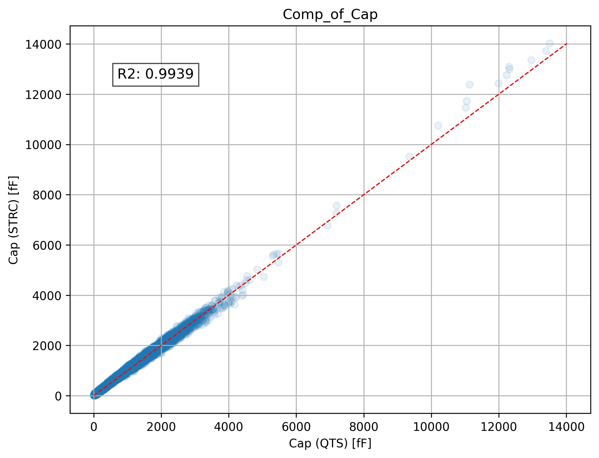
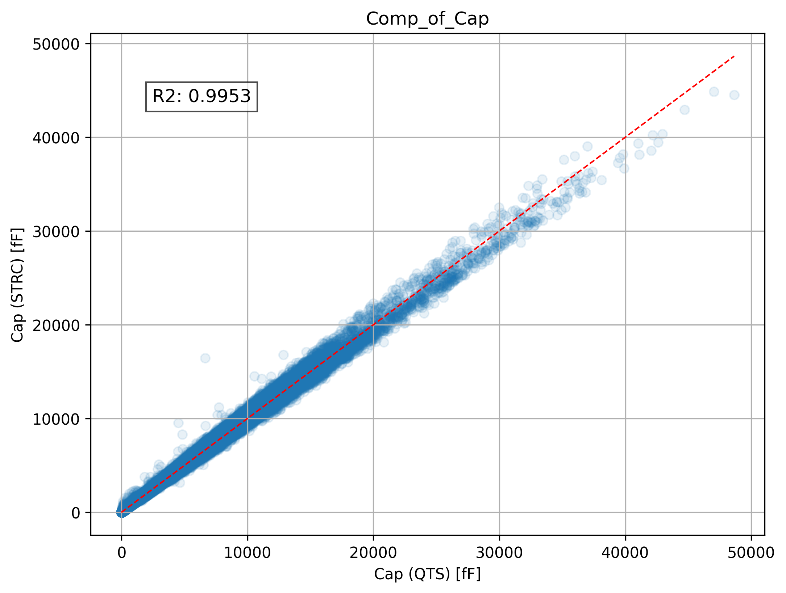
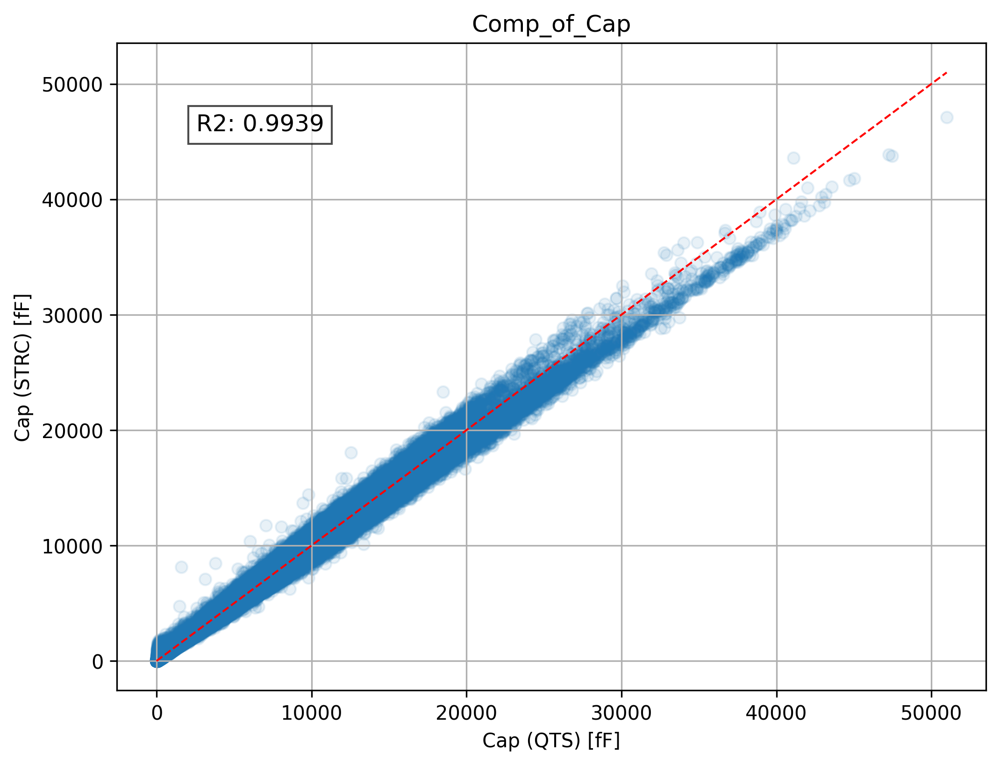
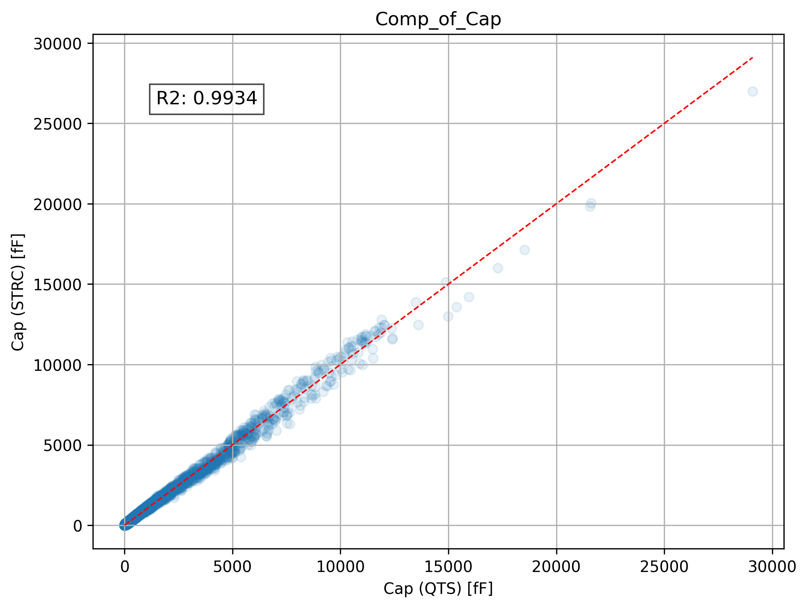
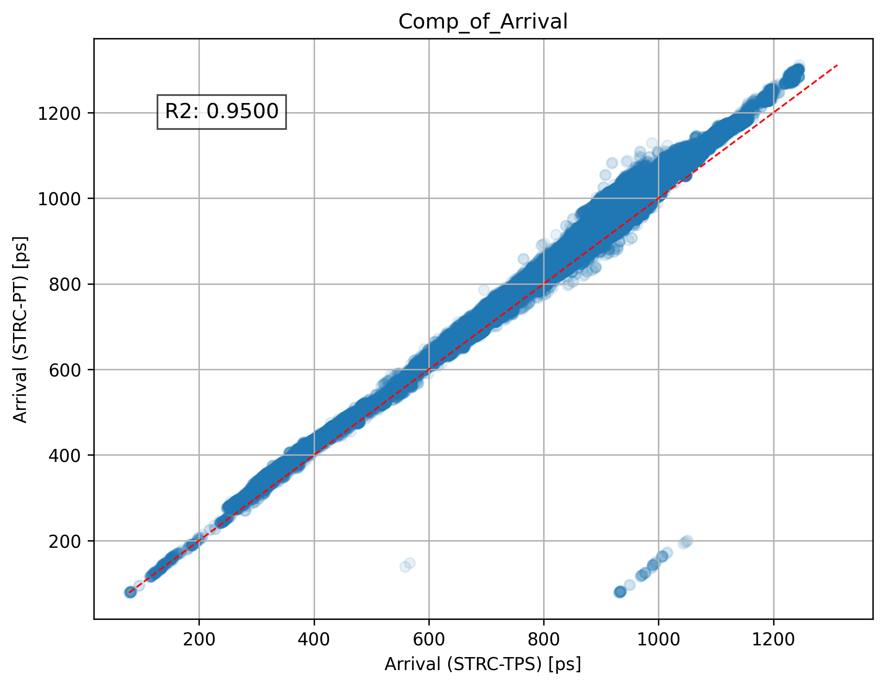
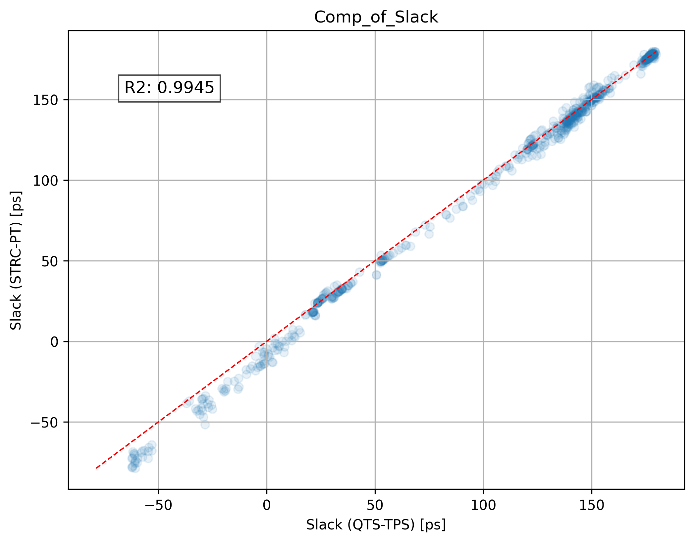
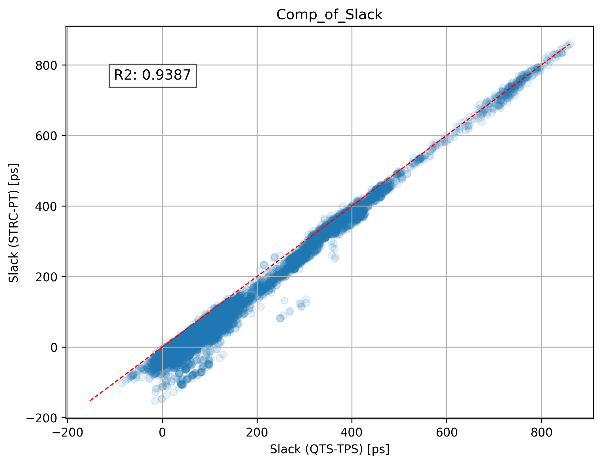
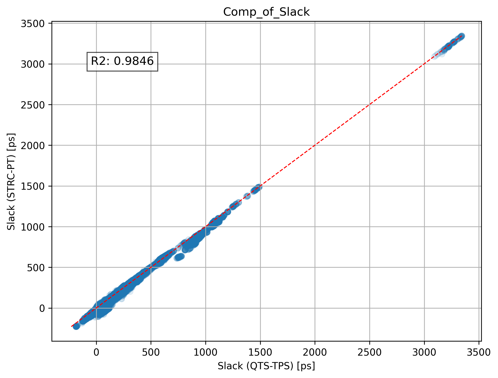
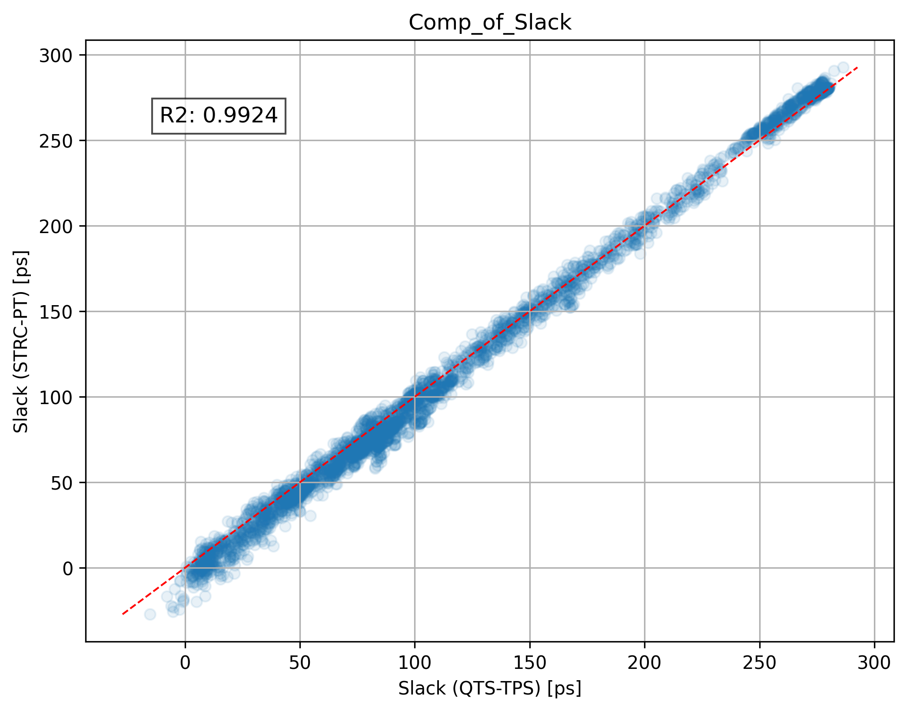

# ASAP7-Synopsys-Enablement
This work was conducted by students at UCSD to help enable fundamental research in EDA using the ASAP7 open-source PDK. 
When the ASAP7 research enablement was first released [[1]](https://github.com/The-OpenROAD-Project/asap7), only Cadence enablement was provided. 
As a result, researchers have not been able to perform post-route extraction and timing, or timing-driven place-and-route (P&R), using Synopsys tools. 
To address these inconveniences, Nishizawa *et al.* released the Synopsys Enablement for ASAP7 [[2]](https://github.com/snishizawa/asap7_snps). They provide a TF file, ITF, and TLU+. However, there are two limitations.
First, the released TF file corresponds only to the x4 of ASAP7, and therefore cannot be used for x1.
Second, the released ITF file estimates wire capacitances to be larger than those in the official QRC tech file.
Therefore, to obtain consistent design results between the two tools, a TF file for x1, along with TLU+ and NXTGRD files that match the official QRC file, is required. Our work develops and makes public TF(x1), TLU+ and other necessary design enablement so that post-route extraction and timing, as well as timing-driven P&R, are possible for Synopsys tool users. 
We provide testcases and example scripts showing “reasonable” correlation of our new Synopsys enablement to the previously-existing Cadence enablement. 
Importantly, please note that indicators of correlation that we present are not, and should not be construed as, "benchmarking" of any kind. 
We make no value judgments regarding the respective merits of commercial EDA tools. We welcome suggestions for improvement or improved materials to be included in this repository; 
please communicate these by email or use GitHub issues, pull requests, etc. Our contact information is provided below. Last, please note and read carefully the headers of all TCL files in this repository that invoke commercial EDA tools. We thank both Cadence and Synopsys for allowing their copyrighted IP to be made publicly available for use by researchers in this manner.

Additionally, the Synopsys enablement for NanGate45 is available here [[3]](https://github.com/ABKGroup/NanGate45-Synopsys-Enablement).

## Contacts
- Andrew B. Kahng (abk@ucsd.edu)
- Sayak Kundu (sakundu@ucsd.edu)
- Jakang Lee (jal216@ucsd.edu)

## Contents 
- [Design Enablement](#Design-Enablement)
  - [RC Calibration Updates (February 2026)](#RC-Calibration-Updates-February-2026)
- [Validation of Design Enablement](#Validation-of-Design-Enablement)
  - [Experimental Flows](#Experimental-Flows)
  - [Types of Timing Path Matching](#Types-of-Timing-Path-Matching)
- [Experimental Results](#Experimental-Results)
  - [Summary](#Summary)
- [Usage and Running Instructions](#Usage-and-Running-Instructions)
  - [How to use](#How-to-use)
  - [Directory and File Descriptions](#Directory-and-File-Descriptions)
  - [Environment](#Environment)
- [References](#References)
- [Appendix](#Appendix)
  - [Experimental Tables and Plots](#Experimental-Tables-and-Plots)


## Design Enablement
The files required for design implementation are as follows.
|                      |  Cadence  | Synopsys |
|:--------------------:|:---------:|:--------:|
|   Physical library   |    LEF   |   LEF   |
|  Technology library  |    LEF   |    TF   |
|    Liberty library   |    LIB   |    DB   |
|   Interconnect File  |    ICT   |   ITF   |
|    RC Lookup Table   | CAPTABLE |   TLU+  |
| Parasitic Extraction |    QRC   |  NXTGRD |

All enablements, except for Synopsys enablement, are taken from [[1]](https://github.com/The-OpenROAD-Project/asap7).
The TF file was generated by converting the official technology file (.lef) using Synopsys Milkyway, and the ITF was created based on layer information extracted from conditionally released official Calibre DRC rules file.
The TLU+ and NXTGRD files were then obtained by converting the ITF file using Synopsys StarRC.

### RC Calibration Updates (February 2026)
This update (February 2026) has been made in order to improve correlation between Cadence QRC-based extraction and Synopsys TLUP/NXTGRD-based extraction. The previous BEOL model had been built mainly from published information, so that mismatches against the QRC reference flow remained in practice. As a result, some designs showed noticeable RC/timing inconsistency even with identical physical design data. The recent work reflected in this update has aimed to reduce this model mismatch.

To reduce model mismatch, we used a decomposition-based fitting approach because net resistance is physically composed of metal contribution (layer sheet resistance and routed length) and via contribution (via resistance and count). For capacitance tuning, we adjusted the effective dielectric constant of the hard mask (HM). For resistance tuning, we fit metal/via terms from per-net decomposition features and extracted net resistance. We also used Cadence Ostrich in parameter-tuning iterations.

In realizing the present update, the ITF model was updated to include/tune resistance-related and capacitance-related terms, and the Synopsys lookup artifacts were regenerated from the updated ITF (`ASAP7/tlup/asap7_1x.tlup`, `ASAP7/tlup/asap7_1x.nxtgrd`). Script support was added so that each net can be decomposed into per-layer routed metal length and per-via-type count, and these decomposition features were used with extracted net resistance for iterative parameter fitting.

With this update, correlation of key timing metrics (including slack) has improved in QRC-vs-TLUP comparisons. The tuned ITF parameters may differ from values reported in ASAP7 papers or PEX rules, but this is a consequence of having been adjusted to reproduce behavior close to the QRC tech-file-based reference.

## Validation of Design Enablement
To validate the Synopsys enablement that we provide, we conduct experiments comparing the results from the flows of two EDA companies (i.e., Synopsys and Cadence) under various conditions. The evaluation metrics we use are as follows:
- **Number of Matching Timing Paths.** This metric is based on the endpoint timing information output by both tools. It measures the consistency of PEX and STA engines between the two tools.
- **Net Capacitance.** The capacitance of all nets in the design. This metric can be further categorized based on whether coupling capacitance is present.
- **Timing Details for Each Endpoint.** The characteristics of all timing endpoints in the design, based on setup analysis. These values can be further categorized based on whether the options for coupling capacitance extraction and signal integrity analysis are enabled.
  - Actual Arrival Time
  - Worst Slack
  - Each Cell Delay
  - Each Wire Delay
  - Each Cell Output Slew
  - Each Wire Output Slew

###  Experimental Flows
We use the following three experimental flows to measure the consistency of wire delays between the two tools. The flows below are sorted alphabetically by the PEX tool names. If the PEX tool names are the same, they are further sorted alphabetically by the STA tool names.

**Flow 1**: This is the standard flow for sign-off, where the timing details of the two tools are compared. A representative example is:
  - 1-1: Quantus & Tempus vs. StarRC & PrimeTime

**Flow 2**: To isolate the effect of SPEF files, the STA engine is fixed, and timing details are compared as follows:
  - 2-1: Quantus & PrimeTime vs. StarRC & PrimeTime
  - 2-2: Quantus & Tempus vs. StarRC & Tempus

**Flow 3**: To isolate the effect of STA engines, the PEX engine is fixed, and timing details are compared as follows:
  - 3-1: Quantus & PrimeTime vs. Quantus & Tempus
  - 3-2: StarRC & PrimeTime vs. StarRC & Tempus
  - 3-3: None & PrimeTime vs. None & Tempus

Here, None indicates that no SPEF file is provided.

For all flows (1–3), coupled capacitance extraction and signal integrity analysis are enabled (true). If you would like to explore other cases, you can adjust the CC and SI parameters and extract data accordingly. However, this repository does not provide analysis for those experiments.
In addition, please note that the results of these flows are not referenced against any particular tool. For example, the experimental result of Flow 1-1 is reported as the average of Quantus & Tempus vs. StarRC & PrimeTime and StarRC & PrimeTime vs. Quantus & Tempus, since the R2 score can vary depending on the order of the data.


### Types of Timing Path Matching
We must note that when extracting timing paths from different tools, the timing paths reported for given endpoints and/or for given analysis requests do not always exactly match. Therefore, for the purpose of comparing the characteristics of the timing paths in our experiment, we define ‘matching timing path types’ as follows:
  - Case 1: The timing paths from both tools have the same cells and transition types (i.e., rise, fall).
  - Case 2: The timing paths from both tools consist of the same cells but have different transition types.
  - Case 3: At least one cell in the timing paths differs between the two tools.

In this repository, Case 1 and Case 2 are used to compare wire parasitic consistency. Additionally, to analyze the timing of paths not included in Case 1 and Case 2, we match all timing endpoints on a one-to-one basis and compare their timing details. While this does not reveal delay differences caused by wire parasitics, it is sufficient to demonstrate the consistency of timing details.

The figure below shows the path matching types in our repository:
<div align="center">
  
  <br>
</div>

## Experimental Results

We summarize the experimental results using tables.
Data and plots can be directly examined, either by following usage instructions below to extract the data yourself, or by checking the files that have been uploaded in the "benchmark" directory.

We use “absolute difference” for evaluation because the scale of the data we handle is very small, and use of relative difference would lead to data distortion.
However, since absolute difference is expressed in absolute terms, its value varies depending on the range of the data. Therefore, when reporting our results here, we use “Normalized Absolute difference.” 
This is simply the mean or the maximum absolute difference, divided by the data range. Here, data range is defined as the difference between the maximum and minimum values across all data points from both groups being compared.

The formula is as follows:  
```
Normalized Absolute Difference = Absolute Difference / (Maximum - Minimum)
```
The abbreviations used in the experimental report have the following meanings:

- DESIGN: The name of the top module in the benchmark.
- CC: Whether or not to include and extract the “Coupling Capacitance” (CC) during parasitic extraction.
- SI: Whether or not to enable “Signal Integrity” (SI) analysis during static timing analysis.
- INVS: Innovus
- FC: Fusion Compiler
- QTS: Quantus
- TPS: Tempus
- STRC: StarRC
- PT: PrimeTime
- PEX: Parasitic Extraction Engine
- STA: Static Timing Analysis Engine

### Summary
- **Number of Matching Timing Paths**  
  Statistics for paths that match both Case 1 and Case 2.
  - Flow 1-1
    - **Lowest matching rate**: 52.94 % (ARIANE)
    - **Average matching rate**: 60.52 %
    - **Highest matching rate**: 69.19 % (JPEG)
      
  - Flow 2-1
    - **Lowest matching rate**: 52.53 % (ARIANE)
    - **Average matching rate**: 67.08 %
    - **Highest matching rate**: 81.53 % (JPEG)
  - Flow 2-2
    - **Lowest matching rate**: 75.95 % (BSG)
    - **Average matching rate**: 78.81 %
    - **Highest matching rate**: 84.72 % (JPEG)
      
  - Flow 3-1
    - **Lowest matching rate**: 66.22 % (BSG)
    - **Average matching rate**: 69.92 %
    - **Highest matching rate**: 74.64 % (JPEG)
  - Flow 3-2
    - **Lowest matching rate**: 60.58 % (BSG)
    - **Average matching rate**: 64.84 %
    - **Highest matching rate**: 74.04 % (JPEG)
  - Flow 3-3
    - **Lowest matching rate**: 35.18 % (ARIANE)
    - **Average matching rate**: 68.42 %
    - **Highest matching rate**: 83.99 % (JPEG)


  - Summary: Summarizing the current benchmark tables, the average path matching rate for Flow 1-1 is 60.52% across the four designs. When fixing the STA engine (Flow 2-1, 2-2), the average matching rate is 72.95%, while fixing the PEX engine (Flow 3-1, 3-2, 3-3) yields 67.73%.


- **Net Capacitance**  
The average net capacitance comparison results across all designs are as follows:
  - **R2 score**: 0.9941
  - **mean normalized absolute difference**: 0.19 %
  - **maximum normalized absolute difference (global maximum across designs)**: 20.15 %
  - **average of per-design maximum normalized absolute difference**: 12.28 %


- **Timing Details for Each Endpoint**  
The comparison results for Actual Arrival Time (AAT) and Slack. Overall, across all designs (Flow 1-1, Case all):
  - **AAT**:
    - **R2 score**: 0.9523
    - **Mean normalized absolute difference**: 2.91 %
    - **Maximum normalized absolute difference (global maximum across designs)**: 69.02 %
    - **Average of per-design maximum normalized absolute difference**: 26.02 %
  
  - **Slack**:
    - **R2 score**: 0.9698
    - **Mean normalized absolute difference**: 2.01 %
    - **Maximum normalized absolute difference (global maximum across designs)**: 17.17 %
    - **Average of per-design maximum normalized absolute difference**: 9.94 %
  
 
## Usage and Running Instructions

### How to use
If you want to run the predefined studies, please use:
```
Usage) ./run.sh
```

If you want to run with a custom combination:
```
Example) make DESIGN=aes_cipher_top PEX_TOOL1=quantus STA_TOOL1=tempus CC1=true SI1=true PEX_TOOL2=starRC STA_TOOL2=primetime CC2=true SI2=true CASE=1
```

The execution results are stored in the "benchmark/(your_design_name)" directory.


### Directory and File Descriptions
Our repository is composed of the following files and directories:  
- **ASAP7**: Directory containing design enablement for Cadence and Synopsys.
- **benchmark**: The design directory that we used for evaluation:
  - Input files for Extracting Design Data (some archives are split to keep each file under GitHub size limits. Reconstruct and extract with `cat` + `tar`.)
    - Example (from repository root):
      - `cat benchmark/bsg_chip/bsg_chip.tar.gz_* | tar -xzf - -C benchmark/bsg_chip`
    - If an archive is not split, use:
      - `tar -xzf benchmark/<design>/<design>.tar.gz -C benchmark/<design>`
    - DEF file with routing
    - Flattened netlist file after routing stage
    - SDC file with all input/output port constraints
  - Output files
    - SPEF files
    - CSV files of net capacitance
    - CSV files of timing details
    - summary files
    - plot
    - done: A directory that collects files used to verify the completion of a particular step in the Makefile. In particular, it deals with generating data tables and plots.
- **scripts**: This directory contains EDA tool scripts that allow users to run PEX and STA according to their preferences.
- **Makefile**: Users can process data from various tools they wish to compare using the make command. This Makefile performs the following functions:
  - It executes the user-selected PEX tool and STA tool to generate CSV files containing net capacitance and timing details. Since two types of data are required for comparison, users must define two flow types (please refer to the example parameters below).
  - It reads the generated CSV files and produces evaluation metrics such as plots, R2 scores, and absolute differences.
  - Parameters
    - **DESIGN**: The top-level block name defined in the DEF and netlist.
    - **PEX_TOOL1 / PEX_TOOL2**: The PEX Engine for extracting the SPEF file. The allowed values are "none", "innovus", "quantus", "fusion_compiler", and "starRC". Innovus utilizes TQuantus which is the built-in PEX engine.
    - **STA_TOOL1 / STA_TOOL2**: The STA engine for extracting timing details. The allowed values are "innovus", "tempus", "fusion_compiler", and "primetime" (case-insensitive, e.g., "PrimeTime" is also accepted).
    - **CC1 / CC2**: Whether to extract coupling capacitance along with the SPEF when using the PEX Engine. The allowed values are "true", "false".
    - **SI1 / SI2**: Whether to extract timing details with signal integrity analysis in the STA engine. The allowed values are "true", "false".
    - **NWORST**: The maximum number of worst paths to extract at each endpoint. This is typically set to 1. The allowed values are the number over one.
    - **CASE**: Which matched path type to assume when extracting timing details (please refer to the aforementioned "path matching type"). The allowed values are "1", "2", "all".
- **run.sh**: The file that defines the presets used in the experiment.


### Environment
For commercial EDA tools, we used the versions below.  
[Cadence]  
- Innovus: 21.1
- Quantus: 21.1
- Tempus: 21.1

[Synopsys]  
- Fusion Compiler: 22.3  
- PrimeTime: 18.6
- StarRC: 18.6

## References
[1] Official ASAP7 repository from [ASAP7](https://github.com/The-OpenROAD-Project/asap7)  
[2] ASAP7-SNPS repository from [ASAP7_SNPS](https://github.com/snishizawa/asap7_snps)  
[3] Nangate45-Synopsys-Enablement from [NanGate45-Synopsys-Enablement](https://github.com/ABKGroup/NanGate45-Synopsys-Enablement)


## Appendix
### Experimental Tables and Plots

#### Number of Matching Timing Paths
- Flow 1-1
<table><thead>
  <tr>
    <th align="center">DESIGN</th>
    <th align="center"># of total timing paths</th>
    <th align="center"># of matched timing paths [Case 1 + Case 2]</th>
  </tr></thead>
<tbody>
  <tr>
    <td align="center">AES</td>
    <td align="right">1,041</td>
    <td align="right">632 (60.71 %)</td>
  </tr>
  <tr>
    <td align="center">ARIANE</td>
    <td align="right">23,215</td>
    <td align="right">12,289 (52.94 %)</td>
  </tr>
  <tr>
    <td align="center">BSG</td>
    <td align="right">253,138</td>
    <td align="right">150,001 (59.26 %)</td>
  </tr>
  <tr>
    <td align="center">JPEG</td>
    <td align="right">4,515</td>
    <td align="right">3,124 (69.19 %)</td>
  </tr>
</tbody>
</table>

- Flow 2-1
<table><thead>
  <tr>
    <th align="center">DESIGN</th>
    <th align="center"># of total timing paths</th>
    <th align="center"># of matched timing paths [Case 1 + Case 2]</th>
  </tr></thead>
<tbody>
  <tr>
    <td align="center">AES</td>
    <td align="right">1,041</td>
    <td align="right">680 (65.32 %)</td>
  </tr>
  <tr>
    <td align="center">ARIANE</td>
    <td align="right">23,215</td>
    <td align="right">12,195 (52.53 %)</td>
  </tr>
  <tr>
    <td align="center">BSG</td>
    <td align="right">253,138</td>
    <td align="right">174,535 (68.95 %)</td>
  </tr>
  <tr>
    <td align="center">JPEG</td>
    <td align="right">4,515</td>
    <td align="right">3,681 (81.53 %)</td>
  </tr>
</tbody>
</table>

- Flow 2-2
<table><thead>
  <tr>
    <th align="center">DESIGN</th>
    <th align="center"># of total timing paths</th>
    <th align="center"># of matched timing paths [Case 1 + Case 2]</th>
  </tr></thead>
<tbody>
  <tr>
    <td align="center">AES</td>
    <td align="right">1,041</td>
    <td align="right">802 (77.04 %)</td>
  </tr>
  <tr>
    <td align="center">ARIANE</td>
    <td align="right">23,215</td>
    <td align="right">18,000 (77.54 %)</td>
  </tr>
  <tr>
    <td align="center">BSG</td>
    <td align="right">253,138</td>
    <td align="right">192,263 (75.95 %)</td>
  </tr>
  <tr>
    <td align="center">JPEG</td>
    <td align="right">4,515</td>
    <td align="right">3,825 (84.72 %)</td>
  </tr>
</tbody>
</table>

- Flow 3-1
<table><thead>
  <tr>
    <th align="center">DESIGN</th>
    <th align="center"># of total timing paths</th>
    <th align="center"># of matched timing paths [Case 1 + Case 2]</th>
  </tr></thead>
<tbody>
  <tr>
    <td align="center">AES</td>
    <td align="right">1,041</td>
    <td align="right">721 (69.26 %)</td>
  </tr>
  <tr>
    <td align="center">ARIANE</td>
    <td align="right">23,215</td>
    <td align="right">16,150 (69.57 %)</td>
  </tr>
  <tr>
    <td align="center">BSG</td>
    <td align="right">253,138</td>
    <td align="right">167,624 (66.22 %)</td>
  </tr>
  <tr>
    <td align="center">JPEG</td>
    <td align="right">4,515</td>
    <td align="right">3,370 (74.64 %)</td>
  </tr>
</tbody>
</table>

- Flow 3-2
<table><thead>
  <tr>
    <th align="center">DESIGN</th>
    <th align="center"># of total timing paths</th>
    <th align="center"># of matched timing paths [Case 1 + Case 2]</th>
  </tr></thead>
<tbody>
  <tr>
    <td align="center">AES</td>
    <td align="right">1,041</td>
    <td align="right">655 (62.92 %)</td>
  </tr>
  <tr>
    <td align="center">ARIANE</td>
    <td align="right">23,215</td>
    <td align="right">14,356 (61.84 %)</td>
  </tr>
  <tr>
    <td align="center">BSG</td>
    <td align="right">253,138</td>
    <td align="right">153,350 (60.58 %)</td>
  </tr>
  <tr>
    <td align="center">JPEG</td>
    <td align="right">4,515</td>
    <td align="right">3,343 (74.04 %)</td>
  </tr>
</tbody>
</table>

- Flow 3-3
<table><thead>
  <tr>
    <th align="center">DESIGN</th>
    <th align="center"># of total timing paths</th>
    <th align="center"># of matched timing paths [Case 1 + Case 2]</th>
  </tr></thead>
<tbody>
  <tr>
    <td align="center">AES</td>
    <td align="right">1,041</td>
    <td align="right">857 (82.32 %)</td>
  </tr>
  <tr>
    <td align="center">ARIANE</td>
    <td align="right">23,215</td>
    <td align="right">8,168 (35.18 %)</td>
  </tr>
  <tr>
    <td align="center">BSG</td>
    <td align="right">253,138</td>
    <td align="right">182,740 (72.19 %)</td>
  </tr>
  <tr>
    <td align="center">JPEG</td>
    <td align="right">4,515</td>
    <td align="right">3,792 (83.99 %)</td>
  </tr>
</tbody>
</table>

#### Net Capacitance

<table><thead>
  <tr>
    <th rowspan="2" align="center">DESIGN</th>
    <th rowspan="2" align="center">Cadence's PEX ↔ Synopsys's PEX</th>
    <th rowspan="2" align="center">R2</th>
    <th colspan="2" align="center">Normalized Absolute Difference</th>
  </tr>
  <tr>
    <th>Mean</th>
    <th>Max</th>
  </tr></thead>
<tbody>
  <tr>
    <td align="center">AES</td>
    <td align="center">QTS ↔ STRC</td>
    <td align="right">0.9939</td>
    <td align="right">0.28%</td>
    <td align="right">8.98%</td>
  </tr>
  <tr>
    <td align="center">ARIANE</td>
    <td align="center">QTS ↔ STRC</td>
    <td align="right">0.9953</td>
    <td align="right">0.20%</td>
    <td align="right">20.15%</td>
  </tr>
  <tr>
    <td align="center">JPEG</td>
    <td align="center">QTS ↔ STRC</td>
    <td align="right">0.9934</td>
    <td align="right">0.09%</td>
    <td align="right">7.17%</td>
  </tr>
  <tr>
    <td align="center">BSG</td>
    <td align="center">QTS ↔ STRC</td>
    <td align="right">0.9939</td>
    <td align="right">0.19%</td>
    <td align="right">12.82%</td>
  </tr>
</tbody>
</table>

<table>
  <tr>
    <td align="center"><strong>AES (QTS vs STRC)</strong></td>
    <td align="center"><strong>ARIANE (QTS vs STRC)</strong></td>
  </tr>
  <tr>
    <td></td>
    <td></td>
  </tr>
  <tr>
    <td align="center"><strong>BSG (QTS vs STRC)</strong></td>
    <td align="center"><strong>JPEG (QTS vs STRC)</strong></td>
  </tr>
  <tr>
    <td></td>
    <td></td>
  </tr>
</table>

#### Timing Details for Each Endpoint

<table><thead>
  <tr>
    <th align="center" rowspan="3">DESIGN</th>
    <th align="center" rowspan="3">TOOLS</th>
    <th align="center" rowspan="3">CASE</th>
    <th align="center" colspan="3">Actual Arrival Time</th>
    <th align="center" colspan="3">Slack</th>
  </tr>
  <tr>
    <th align="center" rowspan="2">R2</th>
    <th align="center" nowrap colspan="2">Normalized Absolute Diff.</th>
    <th align="center" rowspan="2">R2</th>
    <th align="center" nowrap colspan="2">Normalized Absolute Diff.</th>
  </tr>
  <tr>
    <th align="center">Mean</th>
    <th align="center">Max</th>
    <th align="center">Mean</th>
    <th align="center">Max</th>
  </tr></thead>
<tbody>
  <tr>
    <td align="center" nowrap rowspan="18">AES</td>
    <td align="center" nowrap rowspan="3">QTS-TPS ↔ STRC-PT</td>
    <td align="right">1</td>
    <td align="right">0.9925</td>
    <td align="right">1.70%</td>
    <td align="right">8.65%</td>
    <td align="right">0.9945</td>
    <td align="right">1.40%</td>
    <td align="right">9.02%</td>
  </tr>
  <tr>
    <td align="right">2</td>
    <td align="right">0.9874</td>
    <td align="right">2.34%</td>
    <td align="right">6.86%</td>
    <td align="right">0.9937</td>
    <td align="right">1.52%</td>
    <td align="right">5.41%</td>
  </tr>
  <tr>
    <td align="right">all</td>
    <td align="right">0.9873</td>
    <td align="right">2.87%</td>
    <td align="right">10.22%</td>
    <td align="right">0.9898</td>
    <td align="right">2.39%</td>
    <td align="right">10.57%</td>
  </tr>
  <tr>
    <td align="center" nowrap rowspan="3">QTS-PT ↔ STRC-PT</td>
    <td align="right">1</td>
    <td align="right">0.9958</td>
    <td align="right">1.35%</td>
    <td align="right">6.74%</td>
    <td align="right">0.9968</td>
    <td align="right">1.00%</td>
    <td align="right">6.32%</td>
  </tr>
  <tr>
    <td align="right">2</td>
    <td align="right">0.9371</td>
    <td align="right">10.03%</td>
    <td align="right">11.47%</td>
    <td align="right">0.9882</td>
    <td align="right">4.32%</td>
    <td align="right">6.02%</td>
  </tr>
  <tr>
    <td align="right">all</td>
    <td align="right">0.9922</td>
    <td align="right">2.20%</td>
    <td align="right">8.68%</td>
    <td align="right">0.9936</td>
    <td align="right">1.82%</td>
    <td align="right">8.25%</td>
  </tr>
  <tr>
    <td align="center" nowrap rowspan="3">QTS-TPS ↔ STRC-TPS</td>
    <td align="right">1</td>
    <td align="right">0.9993</td>
    <td align="right">0.71%</td>
    <td align="right">4.26%</td>
    <td align="right">0.9996</td>
    <td align="right">0.43%</td>
    <td align="right">3.61%</td>
  </tr>
  <tr>
    <td align="right">2</td>
    <td align="right">0.9771</td>
    <td align="right">3.32%</td>
    <td align="right">4.40%</td>
    <td align="right">0.9986</td>
    <td align="right">0.64%</td>
    <td align="right">2.59%</td>
  </tr>
  <tr>
    <td align="right">all</td>
    <td align="right">0.9992</td>
    <td align="right">0.76%</td>
    <td align="right">4.22%</td>
    <td align="right">0.9996</td>
    <td align="right">0.47%</td>
    <td align="right">3.58%</td>
  </tr>
  <tr>
    <td align="center" nowrap rowspan="3">QTS-TPS ↔ QTS-PT</td>
    <td align="right">1</td>
    <td align="right">0.9988</td>
    <td align="right">0.82%</td>
    <td align="right">3.33%</td>
    <td align="right">0.9986</td>
    <td align="right">0.85%</td>
    <td align="right">3.66%</td>
  </tr>
  <tr>
    <td align="right">2</td>
    <td align="right">0.9963</td>
    <td align="right">1.19%</td>
    <td align="right">3.25%</td>
    <td align="right">0.9961</td>
    <td align="right">1.37%</td>
    <td align="right">2.66%</td>
  </tr>
  <tr>
    <td align="right">all</td>
    <td align="right">0.9987</td>
    <td align="right">0.93%</td>
    <td align="right">3.96%</td>
    <td align="right">0.9986</td>
    <td align="right">0.96%</td>
    <td align="right">3.64%</td>
  </tr>
  <tr>
    <td align="center" nowrap rowspan="3">STRC-TPS ↔ STRC-PT</td>
    <td align="right">1</td>
    <td align="right">0.9950</td>
    <td align="right">1.33%</td>
    <td align="right">8.64%</td>
    <td align="right">0.9953</td>
    <td align="right">1.31%</td>
    <td align="right">9.57%</td>
  </tr>
  <tr>
    <td align="right">2</td>
    <td align="right">0.9879</td>
    <td align="right">2.47%</td>
    <td align="right">5.01%</td>
    <td align="right">0.9928</td>
    <td align="right">1.74%</td>
    <td align="right">5.26%</td>
  </tr>
  <tr>
    <td align="right">all</td>
    <td align="right">0.9909</td>
    <td align="right">2.34%</td>
    <td align="right">9.32%</td>
    <td align="right">0.9913</td>
    <td align="right">2.17%</td>
    <td align="right">10.15%</td>
  </tr>
  <tr>
    <td align="center" nowrap rowspan="3">NONE-PT ↔ NONE-TPS</td>
    <td align="right">1</td>
    <td align="right">0.9978</td>
    <td align="right">1.24%</td>
    <td align="right">3.66%</td>
    <td align="right">0.9989</td>
    <td align="right">0.76%</td>
    <td align="right">3.18%</td>
  </tr>
  <tr>
    <td align="right">2</td>
    <td align="right">0.9897</td>
    <td align="right">2.18%</td>
    <td align="right">6.01%</td>
    <td align="right">0.9947</td>
    <td align="right">1.78%</td>
    <td align="right">2.76%</td>
  </tr>
  <tr>
    <td align="right">all</td>
    <td align="right">0.9976</td>
    <td align="right">1.37%</td>
    <td align="right">4.57%</td>
    <td align="right">0.9986</td>
    <td align="right">0.93%</td>
    <td align="right">3.18%</td>
  </tr>
  <tr>
    <td align="center" nowrap rowspan="18">ARIANE</td>
    <td align="center" nowrap rowspan="3">QTS-TPS ↔ STRC-PT</td>
    <td align="right">1</td>
    <td align="right">0.9205</td>
    <td align="right">3.69%</td>
    <td align="right">17.75%</td>
    <td align="right">0.9387</td>
    <td align="right">3.16%</td>
    <td align="right">17.63%</td>
  </tr>
  <tr>
    <td align="right">2</td>
    <td align="right">0.9509</td>
    <td align="right">3.16%</td>
    <td align="right">9.11%</td>
    <td align="right">0.9612</td>
    <td align="right">2.69%</td>
    <td align="right">8.82%</td>
  </tr>
  <tr>
    <td align="right">all</td>
    <td align="right">0.9147</td>
    <td align="right">3.36%</td>
    <td align="right">16.02%</td>
    <td align="right">0.9214</td>
    <td align="right">3.17%</td>
    <td align="right">17.17%</td>
  </tr>
  <tr>
    <td align="center" nowrap rowspan="3">QTS-PT ↔ STRC-PT</td>
    <td align="right">1</td>
    <td align="right">0.9454</td>
    <td align="right">2.97%</td>
    <td align="right">16.61%</td>
    <td align="right">0.9450</td>
    <td align="right">3.01%</td>
    <td align="right">16.90%</td>
  </tr>
  <tr>
    <td align="right">2</td>
    <td align="right">0.9793</td>
    <td align="right">2.84%</td>
    <td align="right">9.85%</td>
    <td align="right">0.9763</td>
    <td align="right">3.22%</td>
    <td align="right">10.15%</td>
  </tr>
  <tr>
    <td align="right">all</td>
    <td align="right">0.9413</td>
    <td align="right">2.73%</td>
    <td align="right">14.98%</td>
    <td align="right">0.9311</td>
    <td align="right">2.99%</td>
    <td align="right">16.46%</td>
  </tr>
  <tr>
    <td align="center" nowrap rowspan="3">QTS-TPS ↔ STRC-TPS</td>
    <td align="right">1</td>
    <td align="right">0.9869</td>
    <td align="right">1.46%</td>
    <td align="right">12.07%</td>
    <td align="right">0.9820</td>
    <td align="right">1.70%</td>
    <td align="right">13.33%</td>
  </tr>
  <tr>
    <td align="right">2</td>
    <td align="right">0.9772</td>
    <td align="right">2.48%</td>
    <td align="right">4.04%</td>
    <td align="right">0.9707</td>
    <td align="right">2.82%</td>
    <td align="right">4.29%</td>
  </tr>
  <tr>
    <td align="right">all</td>
    <td align="right">0.9857</td>
    <td align="right">1.40%</td>
    <td align="right">11.64%</td>
    <td align="right">0.9798</td>
    <td align="right">1.70%</td>
    <td align="right">13.33%</td>
  </tr>
  <tr>
    <td align="center" nowrap rowspan="3">QTS-TPS ↔ QTS-PT</td>
    <td align="right">1</td>
    <td align="right">0.9964</td>
    <td align="right">0.71%</td>
    <td align="right">5.22%</td>
    <td align="right">0.9978</td>
    <td align="right">0.53%</td>
    <td align="right">6.36%</td>
  </tr>
  <tr>
    <td align="right">2</td>
    <td align="right">0.9945</td>
    <td align="right">0.91%</td>
    <td align="right">2.28%</td>
    <td align="right">0.9979</td>
    <td align="right">0.60%</td>
    <td align="right">1.97%</td>
  </tr>
  <tr>
    <td align="right">all</td>
    <td align="right">0.9959</td>
    <td align="right">0.71%</td>
    <td align="right">5.22%</td>
    <td align="right">0.9974</td>
    <td align="right">0.52%</td>
    <td align="right">6.36%</td>
  </tr>
  <tr>
    <td align="center" nowrap rowspan="3">STRC-TPS ↔ STRC-PT</td>
    <td align="right">1</td>
    <td align="right">0.9646</td>
    <td align="right">1.95%</td>
    <td align="right">11.03%</td>
    <td align="right">0.9767</td>
    <td align="right">1.49%</td>
    <td align="right">11.13%</td>
  </tr>
  <tr>
    <td align="right">2</td>
    <td align="right">0.9802</td>
    <td align="right">1.50%</td>
    <td align="right">5.54%</td>
    <td align="right">0.9859</td>
    <td align="right">1.33%</td>
    <td align="right">5.33%</td>
  </tr>
  <tr>
    <td align="right">all</td>
    <td align="right">0.9643</td>
    <td align="right">2.00%</td>
    <td align="right">11.03%</td>
    <td align="right">0.9733</td>
    <td align="right">1.55%</td>
    <td align="right">11.13%</td>
  </tr>
  <tr>
    <td align="center" nowrap rowspan="3">NONE-PT ↔ NONE-TPS</td>
    <td align="right">1</td>
    <td align="right">0.9952</td>
    <td align="right">1.15%</td>
    <td align="right">3.55%</td>
    <td align="right">0.9956</td>
    <td align="right">1.21%</td>
    <td align="right">4.33%</td>
  </tr>
  <tr>
    <td align="right">2</td>
    <td align="right">0.9939</td>
    <td align="right">2.18%</td>
    <td align="right">3.68%</td>
    <td align="right">0.9962</td>
    <td align="right">1.90%</td>
    <td align="right">2.74%</td>
  </tr>
  <tr>
    <td align="right">all</td>
    <td align="right">0.9904</td>
    <td align="right">1.39%</td>
    <td align="right">3.31%</td>
    <td align="right">0.9896</td>
    <td align="right">1.40%</td>
    <td align="right">3.90%</td>
  </tr>
  <tr>
    <td align="center" nowrap rowspan="18">BSG</td>
    <td align="center" nowrap rowspan="3">QTS-TPS ↔ STRC-PT</td>
    <td align="right">1</td>
    <td align="right">0.9322</td>
    <td align="right">3.55%</td>
    <td align="right">73.42%</td>
    <td align="right">0.9846</td>
    <td align="right">0.62%</td>
    <td align="right">4.04%</td>
  </tr>
  <tr>
    <td align="right">2</td>
    <td align="right">0.7763</td>
    <td align="right">5.76%</td>
    <td align="right">15.80%</td>
    <td align="right">0.9452</td>
    <td align="right">2.08%</td>
    <td align="right">8.84%</td>
  </tr>
  <tr>
    <td align="right">all</td>
    <td align="right">0.9163</td>
    <td align="right">3.53%</td>
    <td align="right">69.02%</td>
    <td align="right">0.9760</td>
    <td align="right">0.70%</td>
    <td align="right">3.97%</td>
  </tr>
  <tr>
    <td align="center" nowrap rowspan="3">QTS-PT ↔ STRC-PT</td>
    <td align="right">1</td>
    <td align="right">0.9896</td>
    <td align="right">1.29%</td>
    <td align="right">10.80%</td>
    <td align="right">0.9918</td>
    <td align="right">0.45%</td>
    <td align="right">3.42%</td>
  </tr>
  <tr>
    <td align="right">2</td>
    <td align="right">0.9596</td>
    <td align="right">2.49%</td>
    <td align="right">9.19%</td>
    <td align="right">0.9518</td>
    <td align="right">2.91%</td>
    <td align="right">9.15%</td>
  </tr>
  <tr>
    <td align="right">all</td>
    <td align="right">0.9872</td>
    <td align="right">1.33%</td>
    <td align="right">10.52%</td>
    <td align="right">0.9891</td>
    <td align="right">0.48%</td>
    <td align="right">3.47%</td>
  </tr>
  <tr>
    <td align="center" nowrap rowspan="3">QTS-TPS ↔ STRC-TPS</td>
    <td align="right">1</td>
    <td align="right">0.9933</td>
    <td align="right">1.08%</td>
    <td align="right">9.90%</td>
    <td align="right">0.9950</td>
    <td align="right">0.34%</td>
    <td align="right">3.03%</td>
  </tr>
  <tr>
    <td align="right">2</td>
    <td align="right">0.9691</td>
    <td align="right">1.80%</td>
    <td align="right">6.41%</td>
    <td align="right">0.9658</td>
    <td align="right">2.44%</td>
    <td align="right">8.27%</td>
  </tr>
  <tr>
    <td align="right">all</td>
    <td align="right">0.9931</td>
    <td align="right">1.00%</td>
    <td align="right">9.91%</td>
    <td align="right">0.9947</td>
    <td align="right">0.32%</td>
    <td align="right">3.21%</td>
  </tr>
  <tr>
    <td align="center" nowrap rowspan="3">QTS-TPS ↔ QTS-PT</td>
    <td align="right">1</td>
    <td align="right">0.9660</td>
    <td align="right">2.26%</td>
    <td align="right">71.28%</td>
    <td align="right">0.9972</td>
    <td align="right">0.24%</td>
    <td align="right">3.72%</td>
  </tr>
  <tr>
    <td align="right">2</td>
    <td align="right">0.8988</td>
    <td align="right">4.04%</td>
    <td align="right">12.53%</td>
    <td align="right">0.9882</td>
    <td align="right">0.91%</td>
    <td align="right">6.92%</td>
  </tr>
  <tr>
    <td align="right">all</td>
    <td align="right">0.9628</td>
    <td align="right">2.31%</td>
    <td align="right">71.28%</td>
    <td align="right">0.9958</td>
    <td align="right">0.27%</td>
    <td align="right">3.72%</td>
  </tr>
  <tr>
    <td align="center" nowrap rowspan="3">STRC-TPS ↔ STRC-PT</td>
    <td align="right">1</td>
    <td align="right">0.9610</td>
    <td align="right">2.59%</td>
    <td align="right">73.56%</td>
    <td align="right">0.9938</td>
    <td align="right">0.36%</td>
    <td align="right">3.83%</td>
  </tr>
  <tr>
    <td align="right">2</td>
    <td align="right">0.8844</td>
    <td align="right">3.53%</td>
    <td align="right">12.23%</td>
    <td align="right">0.9814</td>
    <td align="right">1.12%</td>
    <td align="right">7.96%</td>
  </tr>
  <tr>
    <td align="right">all</td>
    <td align="right">0.9500</td>
    <td align="right">2.63%</td>
    <td align="right">69.15%</td>
    <td align="right">0.9893</td>
    <td align="right">0.42%</td>
    <td align="right">3.77%</td>
  </tr>
  <tr>
    <td align="center" nowrap rowspan="3">NONE-PT ↔ NONE-TPS</td>
    <td align="right">1</td>
    <td align="right">0.9858</td>
    <td align="right">0.89%</td>
    <td align="right">85.17%</td>
    <td align="right">0.9962</td>
    <td align="right">0.29%</td>
    <td align="right">1.09%</td>
  </tr>
  <tr>
    <td align="right">2</td>
    <td align="right">0.9860</td>
    <td align="right">1.63%</td>
    <td align="right">3.53%</td>
    <td align="right">0.9974</td>
    <td align="right">0.77%</td>
    <td align="right">1.89%</td>
  </tr>
  <tr>
    <td align="right">all</td>
    <td align="right">0.9882</td>
    <td align="right">0.95%</td>
    <td align="right">84.39%</td>
    <td align="right">0.9958</td>
    <td align="right">0.29%</td>
    <td align="right">1.08%</td>
  </tr>
  <tr>
    <td align="center" nowrap rowspan="18">JPEG</td>
    <td align="center" nowrap rowspan="3">QTS-TPS ↔ STRC-PT</td>
    <td align="right">1</td>
    <td align="right">0.9927</td>
    <td align="right">1.76%</td>
    <td align="right">8.12%</td>
    <td align="right">0.9924</td>
    <td align="right">1.76%</td>
    <td align="right">8.03%</td>
  </tr>
  <tr>
    <td align="right">2</td>
    <td align="right">0.9746</td>
    <td align="right">3.85%</td>
    <td align="right">8.64%</td>
    <td align="right">0.9942</td>
    <td align="right">1.70%</td>
    <td align="right">6.92%</td>
  </tr>
  <tr>
    <td align="right">all</td>
    <td align="right">0.9910</td>
    <td align="right">1.89%</td>
    <td align="right">8.83%</td>
    <td align="right">0.9922</td>
    <td align="right">1.77%</td>
    <td align="right">8.03%</td>
  </tr>
  <tr>
    <td align="center" nowrap rowspan="3">QTS-PT ↔ STRC-PT</td>
    <td align="right">1</td>
    <td align="right">0.9963</td>
    <td align="right">1.17%</td>
    <td align="right">7.62%</td>
    <td align="right">0.9970</td>
    <td align="right">0.98%</td>
    <td align="right">7.70%</td>
  </tr>
  <tr>
    <td align="right">2</td>
    <td align="right">0.9828</td>
    <td align="right">4.04%</td>
    <td align="right">7.30%</td>
    <td align="right">0.9974</td>
    <td align="right">1.57%</td>
    <td align="right">3.92%</td>
  </tr>
  <tr>
    <td align="right">all</td>
    <td align="right">0.9951</td>
    <td align="right">1.33%</td>
    <td align="right">7.91%</td>
    <td align="right">0.9965</td>
    <td align="right">1.07%</td>
    <td align="right">7.70%</td>
  </tr>
  <tr>
    <td align="center" nowrap rowspan="3">QTS-TPS ↔ STRC-TPS</td>
    <td align="right">1</td>
    <td align="right">0.9981</td>
    <td align="right">0.92%</td>
    <td align="right">4.75%</td>
    <td align="right">0.9984</td>
    <td align="right">0.75%</td>
    <td align="right">5.40%</td>
  </tr>
  <tr>
    <td align="right">2</td>
    <td align="right">0.9198</td>
    <td align="right">3.31%</td>
    <td align="right">5.88%</td>
    <td align="right">0.9967</td>
    <td align="right">0.58%</td>
    <td align="right">3.49%</td>
  </tr>
  <tr>
    <td align="right">all</td>
    <td align="right">0.9977</td>
    <td align="right">0.99%</td>
    <td align="right">5.29%</td>
    <td align="right">0.9984</td>
    <td align="right">0.76%</td>
    <td align="right">5.40%</td>
  </tr>
  <tr>
    <td align="center" nowrap rowspan="3">QTS-TPS ↔ QTS-PT</td>
    <td align="right">1</td>
    <td align="right">0.9981</td>
    <td align="right">0.88%</td>
    <td align="right">3.21%</td>
    <td align="right">0.9965</td>
    <td align="right">1.25%</td>
    <td align="right">4.39%</td>
  </tr>
  <tr>
    <td align="right">2</td>
    <td align="right">0.9853</td>
    <td align="right">2.53%</td>
    <td align="right">5.62%</td>
    <td align="right">0.9941</td>
    <td align="right">1.55%</td>
    <td align="right">3.80%</td>
  </tr>
  <tr>
    <td align="right">all</td>
    <td align="right">0.9978</td>
    <td align="right">0.90%</td>
    <td align="right">4.91%</td>
    <td align="right">0.9969</td>
    <td align="right">1.15%</td>
    <td align="right">4.39%</td>
  </tr>
  <tr>
    <td align="center" nowrap rowspan="3">STRC-TPS ↔ STRC-PT</td>
    <td align="right">1</td>
    <td align="right">0.9971</td>
    <td align="right">1.04%</td>
    <td align="right">5.43%</td>
    <td align="right">0.9954</td>
    <td align="right">1.40%</td>
    <td align="right">6.04%</td>
  </tr>
  <tr>
    <td align="right">2</td>
    <td align="right">0.9881</td>
    <td align="right">1.99%</td>
    <td align="right">6.94%</td>
    <td align="right">0.9921</td>
    <td align="right">1.87%</td>
    <td align="right">5.16%</td>
  </tr>
  <tr>
    <td align="right">all</td>
    <td align="right">0.9963</td>
    <td align="right">1.14%</td>
    <td align="right">6.01%</td>
    <td align="right">0.9954</td>
    <td align="right">1.38%</td>
    <td align="right">6.04%</td>
  </tr>
  <tr>
    <td align="center" nowrap rowspan="3">NONE-PT ↔ NONE-TPS</td>
    <td align="right">1</td>
    <td align="right">0.9931</td>
    <td align="right">1.82%</td>
    <td align="right">4.90%</td>
    <td align="right">0.9938</td>
    <td align="right">1.72%</td>
    <td align="right">5.67%</td>
  </tr>
  <tr>
    <td align="right">2</td>
    <td align="right">0.9354</td>
    <td align="right">4.81%</td>
    <td align="right">10.01%</td>
    <td align="right">0.9877</td>
    <td align="right">2.00%</td>
    <td align="right">5.73%</td>
  </tr>
  <tr>
    <td align="right">all</td>
    <td align="right">0.9906</td>
    <td align="right">2.07%</td>
    <td align="right">7.46%</td>
    <td align="right">0.9936</td>
    <td align="right">1.77%</td>
    <td align="right">5.67%</td>
  </tr>
</tbody>
</table>


In the case of BSG’s AAT, there were outliers among the results of different STA tools. This can be interpreted, as mentioned in [[3]](https://github.com/ABKGroup/NanGate45-Synopsys-Enablement), as arising from differences in how the STA tools operate.




Our main interest here is QTS-TPS ↔ STRC-PT (i.e., Flow 1-1), so we provide additional Case 1 slack plots for each design.

<table>
  <tr>
    <td align="center"><strong>AES (Flow 1-1, Case 1)</strong></td>
    <td align="center"><strong>ARIANE (Flow 1-1, Case 1)</strong></td>
  </tr>
  <tr>
    <td></td>
    <td></td>
  </tr>
  <tr>
    <td align="center"><strong>BSG (Flow 1-1, Case 1)</strong></td>
    <td align="center"><strong>JPEG (Flow 1-1, Case 1)</strong></td>
  </tr>
  <tr>
    <td></td>
    <td></td>
  </tr>
</table>
